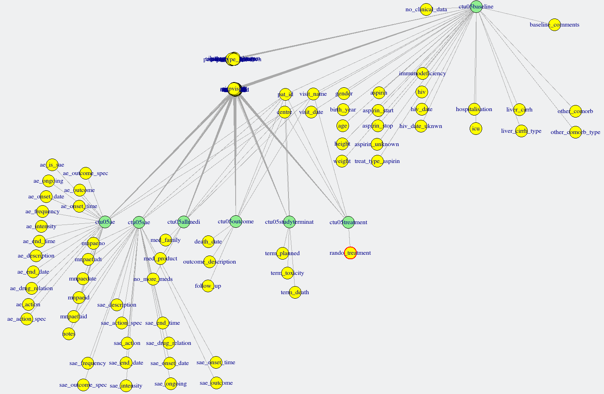

<!-- README.md is generated from README.Rmd. Please edit that file -->


# secuTrialR  [](https://codecov.io/github/SwissClinicalTrialOrganisation/secuTrialR) `r badger::badge_custom("dev version", installed.packages()["secuTrialR", "Version"], "blue", "https://github.com/SwissClinicalTrialOrganisation/secuTrialR")`

An R package to handle data from the clinical data management system (CDMS) [secuTrial](https://www.secutrial.com/en/).

## Installing from github with devtools

```{r, eval = FALSE}
devtools::install_github("SwissClinicalTrialOrganisation/secuTrialR")
```

## Basic usage
Load the package
```{r, echo = TRUE, warning=FALSE, message=FALSE}
library(secuTrialR)
```
Load a dataset 
```{r}
export_location <- system.file("extdata", "s_export_CSV-xls_CTU05_longnames_sep_ref.zip",
                               package = "secuTrialR")
ctu05 <- read_secuTrial(export_location)
```
This will load all sheets from the export into an object of class `secuTrialdata`, which is basically a list. It will always contain `export_details` (which are parsed from the HTML ExportOptions file that secuTrial generates). By default, it will also contain all other files in the dataset. secuTrialR automatically strips file names of dates. The new file names can be seen via `ctu05$export_options$data_names`. The function also adds [labels to variables](#variable-labels) and data.frames, converts [categorical variables to `factor`s](#prepare-factors) and ensures that [dates are `Date`s and date-times are `POSIXct`](#prepare-dates).
`read_secuTrial` is a wrapper for the functions described below, so it is possible to achieve more flexibility by using the individual functions (if necessary).
Individual tables can be extracted from the `ctu05` object via `tab <- ctu05$tab`, where `tab` is the table of interest.

<details><summary>Wrapped functions</summary>


#### Load the dataset
```{r}
# prepare path to example export
export_location <- system.file("extdata", "s_export_CSV-xls_BMD.zip",
                               package = "secuTrialR")
# load all export data
bmd_export <- read_secuTrial_raw(data_dir = export_location)

# load a second dataset
export_location <- system.file("extdata", "s_export_CSV-xls_CTU05_longnames_sep_ref.zip",
                               package = "secuTrialR")
ctu05_raw <- read_secuTrial_raw(export_location)

# View names of the bmd_export object
names(bmd_export)
```

`read_secuTrial_raw` returns an object of class `secuTrialdata`, which is basically a list. It will always contain `export_details` (which are parsed from the HTML ExportOptions file that secuTrial generates). By default, it will also contain all other files in the dataset. secuTrialR automatically strips file names of dates. The new file names can be seen via `bmd_export$export_options$data_names`.
<!-- DEDICATED ACCESSOR FUNCTION FOR DATA_NAMES? might already be implemented in the print method -->

`bmd_export` is a list, with class `secuTrialdata`. To prevent it from printing all data to the console, a special print method returns some useful information about the objects within `bmd_export` instead. The information returned includes the original file name in the datafile, it's name in the `secuTrialdata` object, together with the number of rows and columns and a column indicating whether the object is metadata or not:
```{r}
bmd_export
```

Individual tables can be extracted from the `bmd_export` object via `tab <- bmd_export$tab`, where `tab` is the table of interest.
<!-- accessor function? -->


#### Variable labels
For creating tables, it is often useful to have access to variable labels. secuTrialR supports two main methods for handling them - a named list, or via variable attributes. The list approach works as follows.
```{r}
labs <- labels_secuTrial(bmd_export)
# query the list with the variable name of interest
labs[["age"]]

```

The attribute based approach adds labels as an attribute to a variable, which can then be accessed via `label(var)`.
```{r}
labelled <- label_secuTrial(bmd_export)
label(labelled$bmd$age)
```
Labels can be added to new variables or changed via 
```{r}
label(labelled$bmd$age) <- "Age (years)"
label(labelled$bmd$age)
```
Where units have been defined in the SecuTrial database, they can be accessed or changed analogously (here, age had no unit assigned, but we can add one).
```{r}
units(labelled$bmd$age)
units(labelled$bmd$age) <- "years"
units(labelled$bmd$age)
```
There is a drawback to the attribute based approach - labels will not be propagated if variables are derived and may be lost if variables are edited.

Currently, `label_secuTrial` should be used prior to `dates_secuTrial` or `factorize_secuTrial` so that labels and units are propagated to factor and date variables.


 
#### Prepare factors
It is often useful to have categorical variables as factors (R knows how to handle factors). secuTrialR can prepare factors easily.
```{r, error=TRUE}
factors <- factorize_secuTrial(ctu05_raw)
```
This functions loops through each table of the dataset, creating new factor variables where necessary. The new variables are the same as the original but with `.factor` appended (i.e. a new variable called `sex.factor` would be added to the relevant form).

```{r}
# original variable
str(factors$ctu05baseline$gender)
# factor
str(factors$ctu05baseline$gender.factor)
# cross tabulation
table(original = factors$ctu05baseline$gender, factor = factors$ctu05baseline$gender.factor)
```


#### Prepare dates
Date(time)s are a very common data type. They cannot be easily used though in their export format. This is also easily rectified in secuTrialR:


```{r}
dates <- dates_secuTrial(ctu05_raw)
```

Date variables are converted to `Date` class, and datetimes are converted to `POSIXct` class. Rather than overwriting the original variable, new variables are added with the new class. This is a safetly mechanism in case `NA`s are accidentally created.

```{r}
dates$ctu05baseline[c(1,7), c("aspirin_start", "aspirin_start.date", "hiv_date", "hiv_date.datetime")]
```


#### Recommended approach if not using `read_secuTrial`

```{r, eval=FALSE}
f <- "PATH_TO_FILE"
d <- read_secuTrial_raw(f)
l <- label_secuTrial(d)
fa <- factorize_secuTrial(l)
dat <- dates_secuTrial(fa)

# or, if you like pipes
library(magrittr)
f <- "PATH_TO_FILE"
d <- read_secuTrial_raw(f)
dat <- d %>% 
  label_secuTrial() %>%
  factorize_secuTrial() %>%
  dates_secuTrial()
```

</details>

### Exploratory helpers
`secuTrialR` has a couple of functions to help get to grips with a secuTrial data export. They are intended to be used in an exploratory manner only.

#### as.data.frame
Working with a list can be tiresome so `secuTrialR` provides a `as.data.frame` method to save the `data.frames` in the list to an environment of your choice.

```{r}
ls()
names(ctu05)
as.data.frame(ctu05)
ls()
```

There are also options for selecting specific forms (option `data.frames`), changing names based on regex (options `regex` and `rep`) and specifying whether metadata objects should be returned (option `meta`).


#### Recruitment over time
Recruitment is an important cornerstone for every clinical trial. `secuTrialR` allows for straigt forward visualizion of recuitment
over time for a given export file.

```{r, eval = TRUE}
# show plot
# note that there is no line for Universitätsspital 
# Basel because only one case is registered for this centre
plot_recruitment(ctu05, cex = 1.5, rm_regex = "\\(.*\\)$")
# return the plot data
plot_recruitment(ctu05, return_data = TRUE)
```

Furthermore, recruitment per year and center can be returned.

```{r, eval = TRUE}
annual_recruitment(ctu05, rm_regex = "\\(.*\\)$")
```


#### Form status summary statistics
If you are not sure about how complete the data in you export is, it may be useful to get a quick overview of how well the forms
have been filled.

```{r, eval = TRUE}
count_summary <- form_status_summary(ctu05)
tail(count_summary)
```

As you can see, the majority of forms has been completeley filled. None of the forms were saved empty, with warnings or with errors.
For a more patient id centered statistic you can perform the following.

```{r, eval = FALSE}
form_status_counts(ctu05)
```

This will give you a count based overview per patient id and form. Please note that both `form_status_summary` 
and `form_status_counts` only work with saved forms since unsaved form data is not available in secuTrial exports.

#### Visit plan
secuTrialR can provide a depiction of the visit structure, although only where the visit plan is fixed:
```{r, eval = FALSE}
vs <- visit_structure(ctu05)
plot(vs)
```
<!-- PLOT METHOD DIRECTLY FOR secuTrialdata objects? -->


#### Linking different forms

Linkages amongst forms can be explored with the `links_secuTrial` function. This relies on the `igraph` package to create a network. It is possible to interact with the network, e.g. move nodes around in order to read the labels better. The device ID is returned to the console, but can be ignored. Forms are plotted in deep yellow, variables in light blue.

```{r, eval=FALSE}
links_secuTrial(bmd_export)
```

<!-- Figure has to be generated outside of the Rmd file - resize the window and select view/"fit to screen", export it to a PDF and then convert it to a PNG -->


## For contributors
### Testing with devtools

```{r, eval = FALSE}
# run tests
devtools::test("secuTrialR")
# spell check -> will contain some technical terms beyond the below list which is fine
ignore_words <- c("AdminTool", "allforms", "casenodes", "CDMS", "codebook",
                  "codebooks", "datetime" ,"dir" ,"Hmisc" ,"igraph",
                  "labelled", "mnp", "savedforms", "secutrial", "secuTrial", 
                  "secuTrialdata", "tcltk", "tibble")
devtools::spell_check("secuTrialR", ignore = ignore_words)
```

### Linting with lintr

```{r, eval = FALSE}
# lint the package -> should be clean
library(lintr)
lint_package("secuTrialR", linters = with_defaults(camel_case_linter = NULL,
                                                   object_usage_linter = NULL,
                                                   line_length_linter(125)))
```

### Generating the README file

The README file contains both standard text and interpreted R code. It must therefore be compiled. Changes should be made in the `README.Rmd` file and the file "knited" with R. This is easiest with RStudio, but other methods are available.

```{r, eval = FALSE}
library("knitr")
knit("README.Rmd")
```

### Guidelines for contributors

In order to contribute to this R package you should fork the main repository.
After you have made your changes please run the 
[tests](README.md#testing-with-devtools)
and 
[lint](README.md#linting-with-lintr) your code as 
indicated above. Please also increment the version number and recompile the `README.md` to increment the dev-version badge (requires installing the package after editing the `DESCRIPTION` file). If all tests pass and linting confirms that your 
coding style conforms you can send a pull request (PR).  Changes should also be mentioned in the `NEWS` file.
The PR should have a description to help the reviewer understand what has been 
added/changed. New functionalities must be thoroughly documented, have examples 
and should be accompanied by at least one [test](tests/testthat/) to ensure long term 
robustness. The PR will only be reviewed if all travis checks are successful. 
The person sending the PR should not be the one merging it.

A depiction of the core functionalities for loading can be found [here](inst/extdata/secuTrialR.png).
