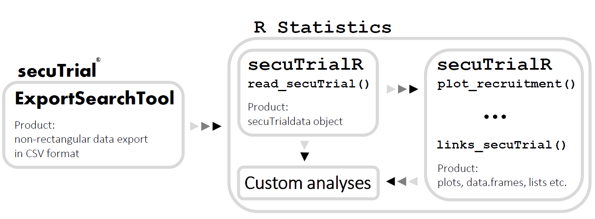

# Summary

Elementary clinical trials have been conducted for hundreds of years [@meinert1986clinical]. The most famous early example
is the proof that sailors scurvy can be cured by the consumption of citrus fruit [@lind_2014] performed by James Lind
in the 18th century. Since these initial days of clinical research, trials have significantly evolved methodically, ethically
and technologically. While it was viable and legitimate to collect clinical trials data in unversioned
spread sheets in the past, this is no longer true and digital clinical data management systems (CDMS) have taken over.
CDMS allow constraint based and version controlled data entry into a clinical trial database which ensures traceability, 
integrity and quality of study data.  

There is a vast market of heterogeneous CDMS solutions each with individual advantages and limitations [@kuchinke_etal_2010].
One limitation can be the interaction with the data after it has been collected. Specifically, a CMDS may be
tailored for optimal data capture while, at least to some extent, disregarding ease-of-use of study data after
the conclusion of data entry. It is, however, vital that the interaction between data sources and data analysts is
fast and seamless in order to avoid loss of valuable time due to technical overhead. This point has been prominently
highlighted by the currently ongoing coronavirus pandemic [@callaway_etal_2020] in which issues have been reported
regarding the timely transfer of information for the preparation of up-to-date infection
counts [@spiegel_meldeluecke]. These issues led to confusion and may have ultimately
delayed important actions. While this is a stark example, it still serves to show how severe the influence
of technical friction between digital systems can be.  

To this end we have developed the open source R statistics [@r_citation] software package `secuTrialR`, which enables
seamless interaction with data collected in the commercially available CDMS
[secuTrial](https://www.secutrial.com) (vendor [interActive Systems Berlin](https://interactive-systems.de/)).
Next to parsing and reading the data it performs data transformation for dates, date times and categorical data
to reduce the data preparation overhead and allow a swift transition into the analytical phase.
Furthermore, `secuTrialR` includes standard functionalities to
show descriptive statistics such as study recruitment or completeness of entered data per case report form
for secuTrial data exports.

# Design

All secuTrial data exports share a certain common technical structure independent of the specific database at hand.
In `secuTrialR` we make use of this information to build an S3 object of class `secuTrialdata` while the
data is being read into R. All downstream functions implemented in `secuTrialR` expect a `secuTrialdata` object as input
but custom analyses with other compenents of R statistics are also an option (see Figure 1).
While editing the `secuTrialdata` object is technically possible, this is not advisable.
Rather it should be treated as raw data archive from which data can be extracted for analysis. However, if necessary,
it is possible to extract subsets of `secuTrialdata` objects with the `subset_secuTrial()` function and return
intact `secuTrialdata` objects.

Figure 1: Information flow from secuTrial to R statistics and within R. Arrows indicate the 
direction from gray towards black. "..." indicates further functions working with `secuTrialdata`
objects.

# Availability

`secuTrialR` is available on GitHub, CRAN and Bioconda [@Gruening-2018-bioconda].

# Dependencies

The development of `secuTrialR` made extensive use of the `tidyverse` [@tidyverse_cit] and greatly benefited from
the `devtools` package [@devtools_cit] and `RStudio` [@rstudio_cit]. Furthermore, `tcltk` and `igraph` [@igraph_cit]
are incorporated.

# interActive Systems statement

InterActive Systems (iAS) has given permission for the open source development of this software
package but accepts no responsibility for the correctness of any functionalities within.

iAS has read and approved this manuscript.

# Acknowledgements

The authors thank Pascal Benkert, Nicole Bruni, Gilles Dutilh, Olivia Ebner, Stefanie von Felten, 
Thomas Fabbro, Inessa Kraft, Arnaud Künzi, Daniel Lengwiler, Armando Lenz, Henry Owusu, Hans Rock, Claudia Rokitta,
Marie Roumet, Constantin Sluka, Suvitha Subramaniam, Miriam Wegmann, Laura Werlen and Thomas Zumbrunn for ideas,
testing and constructive feedback on the `secuTrialR` package.
Furthermore, the authors thank the State Secretariat of Education, Research and Innovation and the Swiss National
Science Foundation for the funding of this project.

# Conflict of interest

The authors are not employees but customers of interActive Systems (iAS). The authors therefore declare
no conflict of interest.

# References
